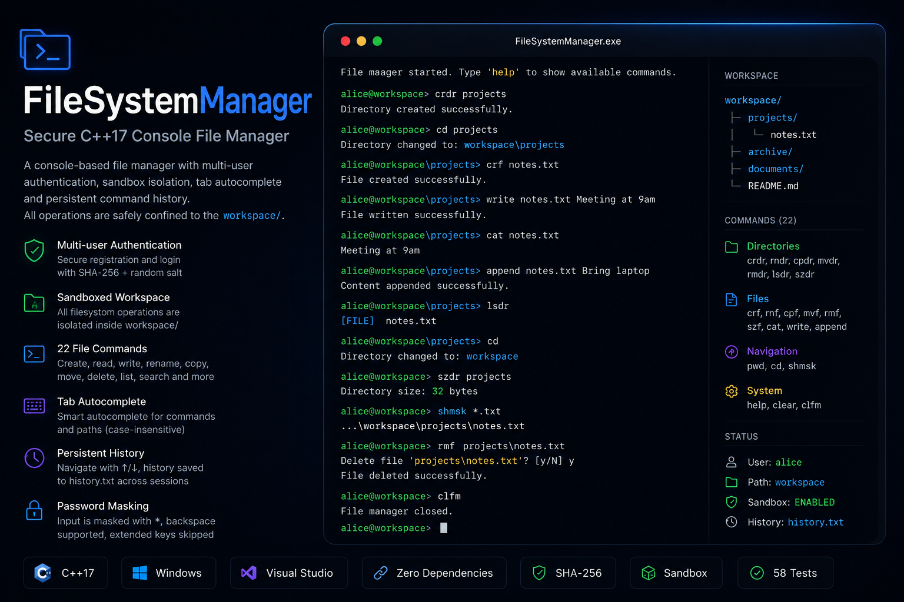
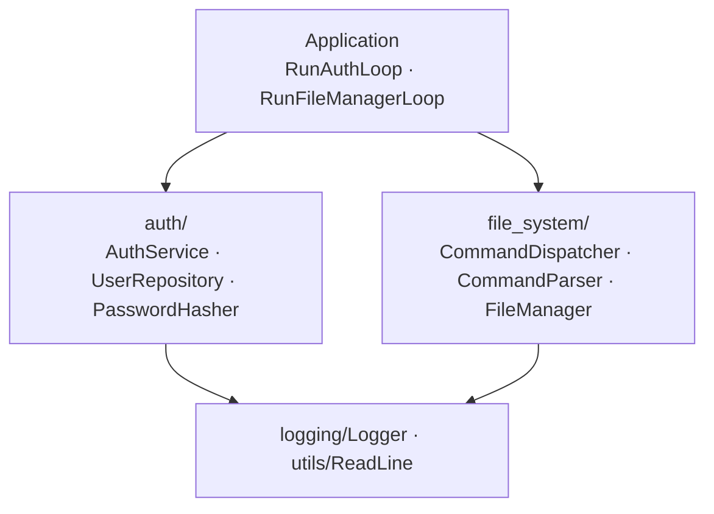

# FileSystemManager




Консольный файловый менеджер с многопользовательской аутентификацией, написан на C++17 **без внешних зависимостей**.

Каждый пользователь изолирован внутри sandbox-директории `workspace/` - ни одна операция не может выйти за её пределы. CLI поддерживает Tab-автодополнение, постоянную историю команд и маскировку пароля.

---

## Демо

```
FileSystemManager.exe

1. Login
2. Register
3. Exit
Choose option: 2
First name: Alice
Last name: Smith
Username: alice
Password: *****
User registered successfully.

Choose option: 1
Username: alice
Password: *****
Login successful. Welcome, Alice!

File manager started. Type 'help' to show available commands.

alice@workspace> crdr projects
Directory created successfully.

alice@workspace> cd projects
Directory changed to: workspace\projects

alice@workspace\projects> crf notes.txt
File created successfully.

alice@workspace\projects> write notes.txt Meeting at 9am
File written successfully.

alice@workspace\projects> cat notes.txt
Meeting at 9am

alice@workspace\projects> append notes.txt Bring laptop
Content appended successfully.

alice@workspace\projects> lsdr
[FILE]  notes.txt

alice@workspace\projects> cd
Directory changed to: workspace

alice@workspace> szdr projects
Directory size: 32 bytes

alice@workspace> shmsk *.txt
...\workspace\projects\notes.txt

alice@workspace> rmf projects\notes.txt
Delete file 'projects\notes.txt'? [y/N] y
File deleted successfully.

alice@workspace> clfm
File manager closed.
```

---

## Возможности

| Возможность | Описание |
|---|---|
| Аутентификация | Регистрация и вход с хешированием паролей SHA-256 + случайная соль |
| Sandbox | Все операции ограничены директорией `workspace/`; traversal-атаки заблокированы |
| Tab-автодополнение | Команды на первом токене, пути - на аргументах; без учёта регистра |
| История команд | Навигация ↑/↓; сохраняется в `history.txt` между сессиями |
| Маскировка пароля | Ввод отображается как `*`; Backspace работает; специальные клавиши игнорируются |
| 22 команды | Создание, переименование, копирование, перемещение, удаление, просмотр, размер, чтение, запись, поиск |

---

## Архитектура



**Правило зависимостей:** каждая стрелка направлена вниз. Нет циклических зависимостей. Каждый слой знает только о слоях ниже него.

---

## Команды

### Директории

| Команда | Аргументы | Описание |
|---|---|---|
| `crdr` | `<path>` | Создать директорию |
| `rndr` | `<from> <to>` | Переименовать директорию |
| `cpdr` | `<from> <to>` | Копировать директорию (рекурсивно) |
| `mvdr` | `<from> <to>` | Переместить директорию |
| `rmdr` | `<path>` | Удалить директорию (запрашивает y/N) |
| `lsdr` | `[path]` | Показать содержимое директории (по умолчанию: текущая) |
| `szdr` | `[path]` | Показать размер директории (по умолчанию: текущая) |

### Файлы

| Команда | Аргументы | Описание |
|---|---|---|
| `crf` | `<path>` | Создать пустой файл |
| `rnf` | `<from> <to>` | Переименовать файл |
| `cpf` | `<from> <to>` | Копировать файл |
| `mvf` | `<from> <to>` | Переместить файл |
| `rmf` | `<path>` | Удалить файл (запрашивает y/N) |
| `szf` | `<path>` | Показать размер файла в байтах |
| `cat` | `<path>` | Вывести содержимое файла |
| `write` | `<path> <text>` | Записать строку в файл (перезаписывает) |
| `append` | `<path> <text>` | Дописать строку в конец файла |

### Навигация

| Команда | Аргументы | Описание |
|---|---|---|
| `pwd` | - | Показать текущую директорию |
| `cd` | `[path]` | Сменить директорию (без аргумента -> корень workspace) |
| `shmsk` | `[path] <mask>` | Рекурсивный поиск по glob-маске (символы `*`, `?`, например `*.txt`, `notes_?.md`) |

### Система

| Команда | Описание |
|---|---|
| `help` | Показать все команды |
| `clear` | Очистить экран |
| `clfm` | Выйти из файлового менеджера |

---

## Сборка

**Требования:** Visual Studio 2017 или новее, C++17, Windows 10+

1. Открыть `FileSystemManager.sln`
2. Выбрать конфигурацию: `Debug` или `Release`, платформа `x64`
3. Собрать -> `Ctrl+Shift+B`

Исполняемый файл создаётся в `x64\Debug\` или `x64\Release\`. Запускать из корня проекта, чтобы `users.txt`, `logs.txt` и `history.txt` создавались рядом с `.sln`.

Никакого CMake, vcpkg или NuGet-пакетов.

---

## Тесты

Решение включает отдельный тестовый проект `FileSystemManagerTests` с покрытием всех ключевых модулей.

| Файл | Тестов | Что покрывает |
|---|---|---|
| `CommandParserTests.h` | 10 | Пустой ввод, пробелы, кавычки, смешанные аргументы |
| `CommandDispatcherTests.h` | 30 | Все 22 команды, подтверждение удаления, dispatch-поведение |
| `FileManagerTests.h` | 30 | Операции с файлами и директориями, traversal-защита, SearchByMask |
| `PasswordHasherTests.h` | 11 | Формат соли, верный/неверный пароль, legacy SHA-256 fallback |
| `UserRepositoryTests.h` | 7 | Сохранение, отклонение дубликата, сохранность полей |

**Запуск из Visual Studio:** установить `FileSystemManagerTests` как стартовый проект -> `Ctrl+F5`.

**Запуск из PowerShell (рекомендуется перед каждым push):**

```powershell
.\run_tests.ps1
```

Скрипт автоматически находит MSBuild через `vswhere`, собирает тестовый проект и запускает исполняемый файл. Код выхода `0` означает, что все тесты прошли.

**Добавление теста для новой команды:** добавить блок `TEST(Dispatcher_<Command>_...)` в `FileSystemManagerTests/src/tests/CommandDispatcherTests.h`. Макрос `TEST()` регистрирует его автоматически - изменений в `main.cpp` или vcxproj не требуется.

---

## Архитектурные решения

### SHA-256 с нуля
В стандартной библиотеке нет хеширования. Вместо подключения OpenSSL или Botan ради одной функции SHA-256 реализован в ~90 строках по спецификации FIPS 180-4. Все вспомогательные функции (`BigSigma`, `SmSigma`, `Ch`, `Maj`) - `constexpr`; `ProcessBlock` находится в анонимном пространстве имён. Сборка остаётся полностью автономной.

### Диспетчер команд на `std::unordered_map`
Первоначальная цепочка `if-else if` росла линейно с каждой командой. Диспетчер на основе map (`CommandDispatcher`) регистрирует все 22 обработчика в `RegisterCommands()` как лямбды. Добавление новой команды - одна запись. `GetCommandNames()` возвращает отсортированные ключи - единственный источник истины для Tab-автодополнения и `ShowHelp`.

### `ShowHelp` из метаданных обработчиков
Каждая запись обработчика содержит строки `usage` и `description`. `ShowHelp` перебирает список категорий и читает метаданные из map. Дублирования описаний нет - каждое описание живёт ровно в одном месте.

### `std::optional<User>` для сессии
`RunAuthLoop()` возвращает `std::optional<User>`. Вызывающий код проверяет `if (!user)` вместо булевого флага и отдельного объекта. `nullopt` означает "выход" - никаких sentinel-значений.

### Защита от directory traversal через path iterator
`ResolvePath` вызывает `fs::weakly_canonical`, затем сравнивает результат с `rootPath` компонент за компонентом через `path::iterator`. Строковая проверка (например, `find("/workspace")`) пропустила бы `../workspace2`. Сравнение через итератор устойчиво к этому классу обходов.

### `Completer` как типизированный псевдоним
```cpp
using Completer = std::function<std::vector<std::string>(const std::string& prefix,
                                                          const std::string& linePrefix)>;
```
`linePrefix` позволяет `ReadLine` оставаться универсальным - он не знает, что такое "команда". `Application` сам решает: пустой prefix -> имена команд, непустой -> пути файловой системы.

---

## Безопасность

**Пароли хранятся в хешированном виде, не в открытом тексте.** Каждый пароль солится 16 случайными байтами перед SHA-256-хешированием. Хранимая запись имеет вид `<hex-соль>:<hex-хеш>`. Устаревшие записи без разделителя соли обрабатываются прозрачно через fallback в `Verify`.

**Известные ограничения (приемлемо для портфолио-проекта):**

- SHA-256 - быстрый хеш. В продакшене следует использовать PBKDF2, bcrypt или Argon2, чтобы сделать брутфорс вычислительно дорогим. Этот проект избегает внешних библиотек намеренно.
- `users.txt` не имеет блокировки. Одновременная запись из нескольких процессов может повредить файл.
- Соль генерируется `std::mt19937`, инициализированным из `std::random_device`. На большинстве платформ `random_device` предоставляет криптографически качественную энтропию; на некоторых старых сборках MinGW - нет. Для продакшена следует использовать `BCryptGenRandom` (Windows) или `/dev/urandom` напрямую.

---

## Структура проекта

```
FileSystemManager/
├── README.md
├── FileSystemManager.sln
├── run_tests.ps1
├── FileSystemManager/
│   ├── FileSystemManager.vcxproj
│   ├── commands.md
│   └── src/
│       ├── main.cpp
│       ├── app/
│       │   └── Application.h / .cpp
│       ├── auth/
│       │   ├── User.h
│       │   ├── AuthService.h / .cpp
│       │   ├── UserRepository.h / .cpp
│       │   └── PasswordHasher.h / .cpp
│       ├── file_system/
│       │   ├── Command.h
│       │   ├── CommandParser.h / .cpp
│       │   ├── CommandDispatcher.h / .cpp
│       │   └── FileManager.h / .cpp
│       ├── logging/
│       │   └── Logger.h / .cpp
│       └── utils/
│           ├── Color.h
│           └── ReadLine.h / .cpp
└── FileSystemManagerTests/
    ├── FileSystemManagerTests.vcxproj
    └── src/
        ├── main.cpp
        └── tests/
            ├── TestFramework.h
            ├── CommandParserTests.h
            ├── CommandDispatcherTests.h
            ├── FileManagerTests.h
            ├── PasswordHasherTests.h
            └── UserRepositoryTests.h
```
